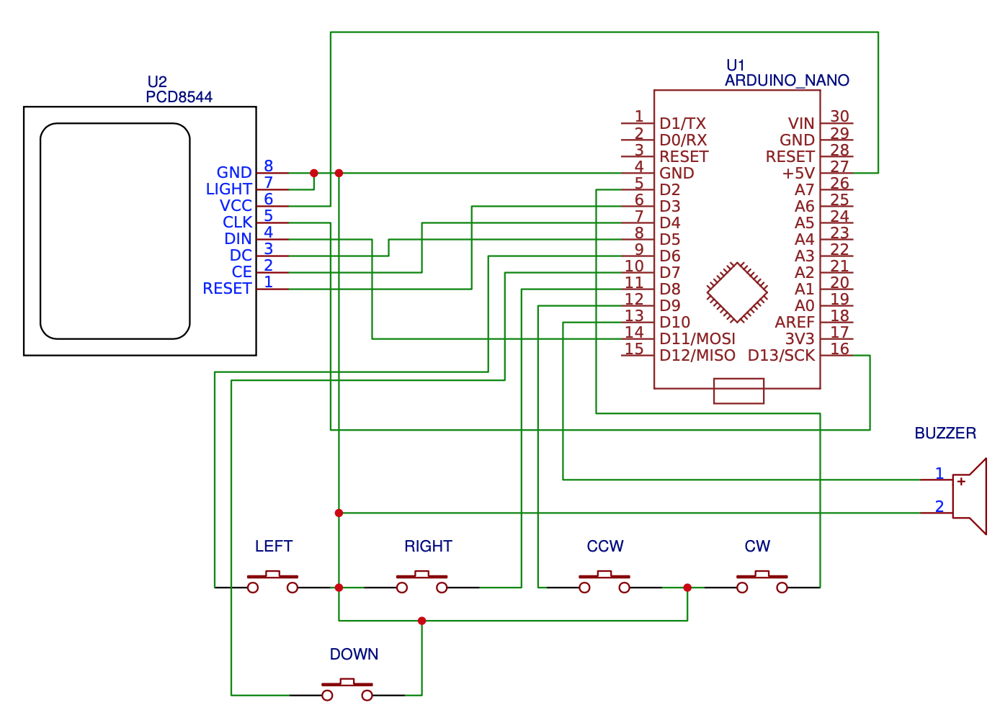

# TetrisDuino

Arduino DIY Tetris Clone with Nokia 5110 LCD display.

*Note: If you press both rotate buttons, the game will pause. Resume by pressing any button.*

[Demo video](https://www.youtube.com/watch?v=s8T8R0CG4j4)

## Schematic

[Download PDF](Schematic.pdf)

## Parts

- [Arduino UNO or Nano](
https://www.aliexpress.com/w/wholesale-arduino-nano.html?spm=a2g0o.productlist.search.0)

- [Nokia 5510/3310 display](
https://www.aliexpress.com/item/84-48-LCD-Module-White-backlight-adapter-pcb-for-Nokia-5110/1859113549.html?spm=a2g0s.9042311.0.0.27424c4dkSwiCc)

- [Boost converter to be able to use 2xAA batteries](
https://www.aliexpress.com/item/1005003932299815.html?spm=a2g0o.productlist.main.25.3a71lZ1zlZ1z3D&algo_pvid=fb60febd-5ee4-4403-a536-b752e428c8df&algo_exp_id=fb60febd-5ee4-4403-a536-b752e428c8df-12&pdp_npi=4%40dis%21BGN%214.50%213.15%21%21%212.39%21%21%40210321c616969551028094279e4699%2112000027498030009%21sea%21BG%21732053526%21&curPageLogUid=BSSFSctI8NXR)

- 5x Buttons (Left, Right, Down, Rotate CCW and Rotate CW)

## Pins

### Display

- RST to D3
- CE to D4
- DC to D5
- DIN to D11
- CLK to D13
- VCC to 5v
- LIGHT to switch to GND
- GND to GND

### Buttons (GND)
- Left: D6
- Down: D7
- Right: D8
- Rotate CCW: D9
- Rotate CW: D2

###  Buzzer (GND)
- Buzzer to D10

